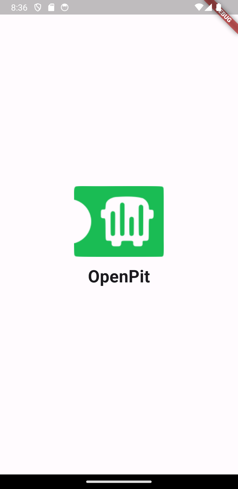
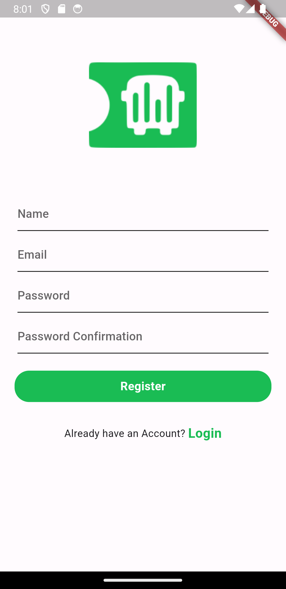
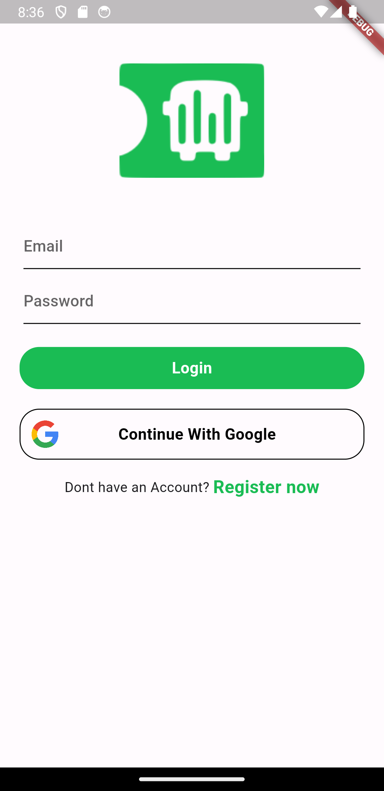
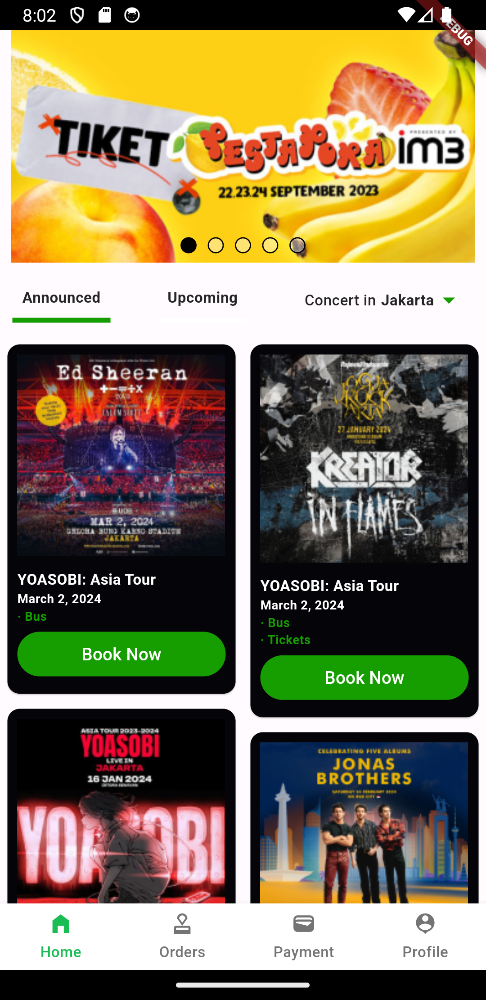
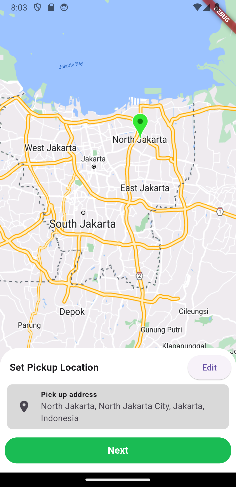
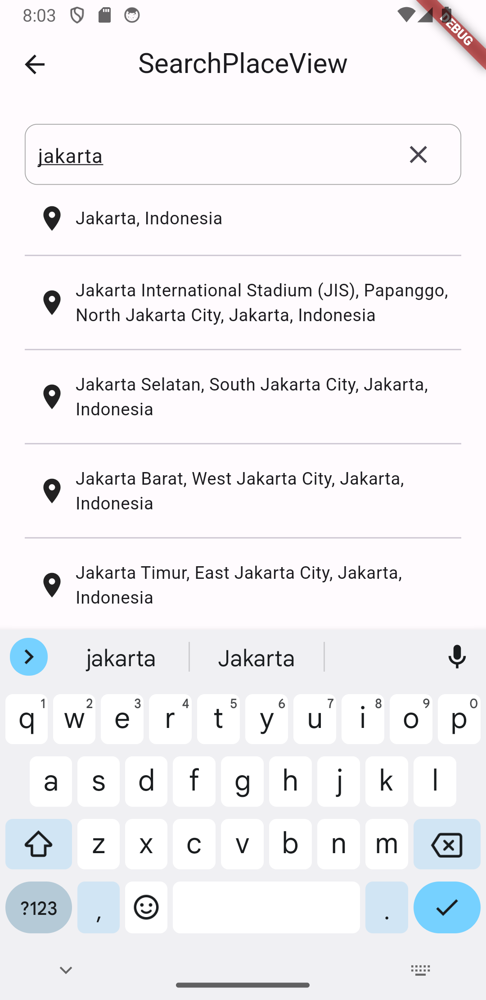
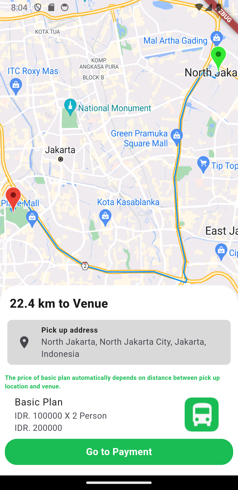
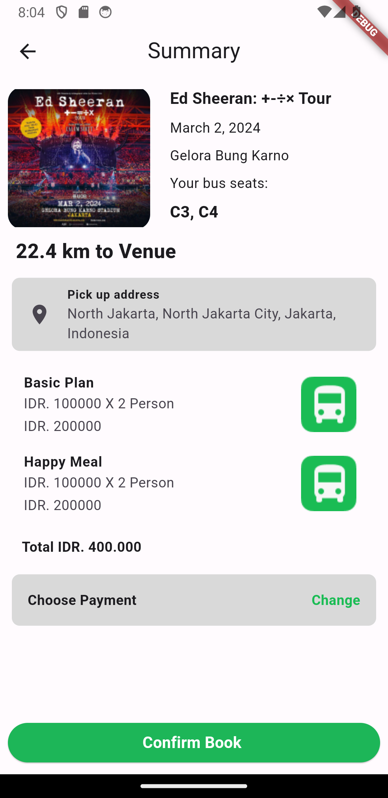

# OpenPit

Open Pit is a mobile application presented by Medhal Team GDSC UB. This mobile application provides a pick-up and drop-off service for concert goers using bus transportation in order to reduces traffic jams, air pollution and noise pollution.This also makes it easier for users to get transportation services when watching concerts or festivals.

## Team Member

- M Azkan Nawal Addufairi (Hipster)
- Ivan Rafli Adipratama (Hacker)
- Fatkhur Rahman (Hustler)

## Screenshot

